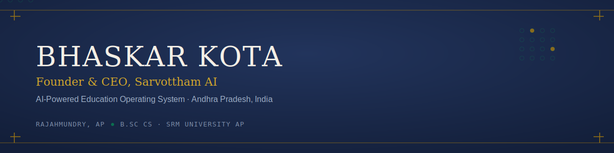
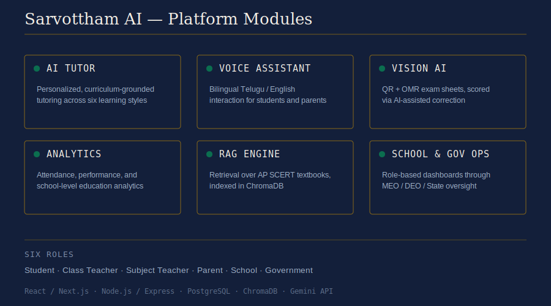
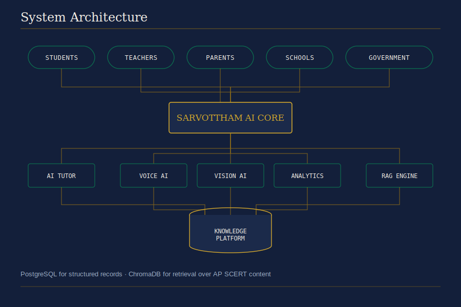
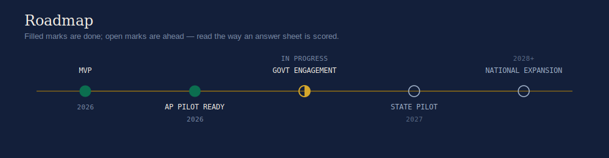
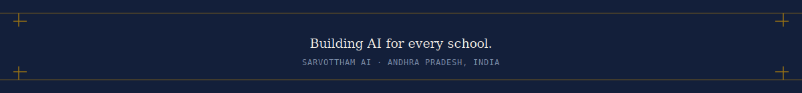

<table>
<tr>
<td width="160" align="center">

</td>
<td valign="middle">
<strong>Kota Venkat Pavan Adithya Bhaskar</strong> 
 
Rajahmundry, Andhra Pradesh &middot; B.Sc CS, SRM University AP
</td>
</tr>
</table>

 

`Founder` · `Pre-Pilot Stage` · `Rajahmundry, AP, India` · `Building in public`

 

## About

I'm building **Sarvottham AI**, an AI-powered Education Operating System for
government and affordable private schools in Andhra Pradesh — personalized
learning grounded in the AP SCERT curriculum, bilingual Telugu/English
support, and tools for school management, teacher assistance, and education
analytics.

- 🔭 Building Sarvottham AI end-to-end — product, architecture, and go-to-market
- 🏛 Engaging the Andhra Pradesh education ministry toward a state pilot
- 🌱 Learning: agentic AI systems, RAG pipelines, and applied ML for education
- 📍 Rajahmundry, Andhra Pradesh, India · B.Sc CS, SRM University AP

**Currently building:**
<!-- ACTIVITY:START -->
**[bhaskarkota-lab](https://github.com/bhaskarkota-lab/bhaskarkota-lab)** — No description yet _(updated 2026-07-23)_
<!-- ACTIVITY:END -->

 

## Sarvottham AI

 

<b>See how it's built →</b> system architecture

 

<b>Where this is headed →</b> roadmap

 

 

## Tech Stack

 

## GitHub Activity

Snake and metrics assets are generated by <code>.github/workflows/snake.yml</code> and
<code>.github/workflows/metrics.yml</code> — see <a href="docs/setup.md">docs/setup.md</a> to enable them.

 

